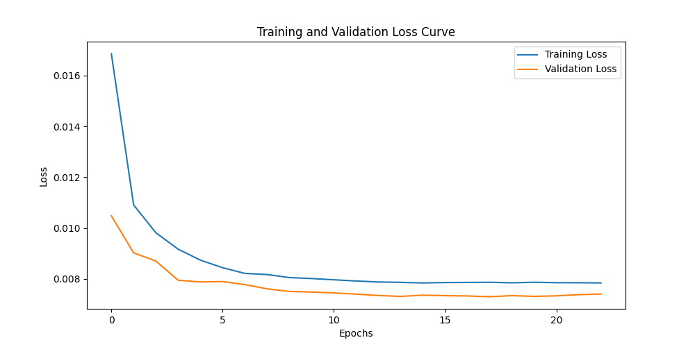
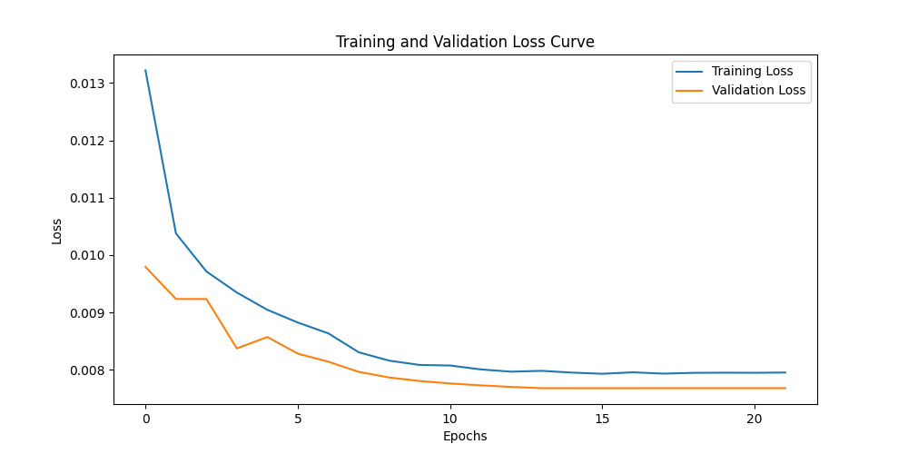

# Comparación de Modelos CNN y VIT para Clasificación de Morfología de Galaxias

Este proyecto tiene como objetivo comparar el rendimiento de dos tipos de modelos de aprendizaje profundo, una Red Neuronal Convolucional (CNN) utilizando el modelo Efficient-B0 y un Transformador de Imágenes (VIT) utilizando el modelo DEIT-Tiny, para la tarea de clasificación de morfología de galaxias utilizando datos del proyecto Galaxy Zoo disponibles en Kaggle.

## Contenido

- [Introducción](#introducción)
- [Dataset](#dataset)
- [Modelos](#modelos)
- [Preprocesamiento y Aumento de Datos](#preprocesamiento-y-aumento-de-datos)
- [Entrenamiento de los Modelos](#entrenamiento-de-los-modelos)
- [Resultados](#resultados)
- [Conclusiones](#conclusiones)
- [Cómo Usar](#cómo-usar)
- [Detalles Técnicos del Código](#detalles-técnicos-del-código)
- [Contribuciones](#contribuciones)
- [Licencia](#licencia)
- [Contacto](#contacto)

## Introducción

En la era de la astronomía moderna, la clasificación de galaxias es fundamental para entender la estructura y evolución del universo. Este proyecto compara dos enfoques de vanguardia en el aprendizaje profundo para esta tarea.

## Dataset

El dataset utilizado proviene de [Galaxy Zoo](https://www.galaxyzoo.org/), un proyecto de ciencia ciudadana donde voluntarios clasifican la morfología de galaxias. Los datos se obtuvieron de [Kaggle](https://www.kaggle.com/), conteniendo miles de imágenes de galaxias clasificadas en diferentes categorías morfológicas.

## Modelos

### Efficient-B0 (CNN)

Efficient-B0 es un modelo CNN que combina técnicas de optimización y arquitectura eficiente para lograr un rendimiento superior con menos parámetros. Para más detalles sobre Efficient-B0, se puede consultar el [paper original](https://arxiv.org/pdf/1905.11946).

### DEIT-Tiny (VIT)

DEIT-Tiny es un modelo de Transformador de Imagen (VIT) que adopta un enfoque basado en atención para procesar imágenes. Para más detalles sobre DEIT-Tiny, se puede consultar el [paper original](https://arxiv.org/pdf/2012.12877).

#### Similitud en el Tamaño de los Modelos

Una similitud clave entre Efficient-B0 y DEIT-Tiny es su tamaño compacto y eficiente:

- **Efficient-B0**: Aproximadamente 5.3 millones de parámetros.
- **DEIT-Tiny**: Aproximadamente 5.7 millones de parámetros.

Ambos modelos están diseñados para ser ligeros y eficientes, lo que los hace adecuados para tareas de clasificación con recursos computacionales limitados.

## Preprocesamiento y Aumento de Datos

Antes de entrenar los modelos, las imágenes se preprocesaron y se les aplicaron técnicas de aumento de datos:

- **Redimensionamiento**: 224x224 píxeles.
- **Normalización**: Utilizando los valores medios y desviaciones estándar de los canales RGB.
- **Aumento de Datos**:
  - Rotaciones aleatorias de hasta 45 grados.
  - Volteos horizontales y verticales.
  - Adición de ruido gaussiano y de Poisson.

## Entrenamiento de los Modelos

Ambos modelos se reentrenaron utilizando los datos de Galaxy Zoo. El proceso incluyó:
- División del dataset: en conjuntos de entrenamiento (80%) y validación (20%).
- Entrenamiento en una GPU GTX 1060 con 6 GB de VRAM.
- Evaluación del rendimiento mediante la pérdida de validación utilizando la función de pérdida Mean Squared Error (MSELoss).

## Resultados

### Curvas de Pérdida

- **Efficient-B0**: Pérdida de validación de 0.0077 y precisión de 80.58%.
- **DEIT-Tiny**: Pérdida de validación de 0.0081 y precisión de 79.72%.

## Conclusiones

La comparación entre Efficient-B0 y DEIT-Tiny revela que, aunque ambos modelos son poderosos, Efficient-B0 mostró una ligera ventaja en términos de precisión y pérdida de validación. La combinación de ambos enfoques podría ofrecer una solución robusta para la clasificación automática de galaxias.
